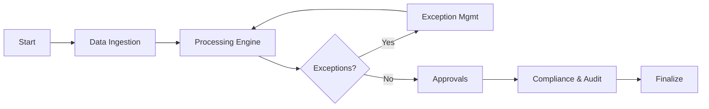

# Payroll Bureau - Project Documentation & Wireframes

## 1. Executive Summary
**Product Name:** Payroll Bureau (SaaS Prototype)
**Version:** 1.0 (High-Fidelity Prototype)

The Payroll Bureau is a centralized, multi-tenant payroll processing platform designed for mid-to-large enterprises. It enables organizations to manage payroll data, execute complex processing rules, handle exceptions, and ensure statutory compliance through a secure, modern web interface.

## 2. Technical Architecture
**Stack:**
-   **Framework:** Next.js 15 (App Router, TypeScript)
-   **Styling:** Vanilla CSS Modules (Zero-runtime overhead, scoped styling)
-   **Icons:** Lucide React
-   **Charts:** Recharts
-   **State Management:** React Hooks (Local state for prototype)

**Project Structure:**
```
src/
├── app/                  # App Router pages
│   ├── (auth)/           # Authentication routes
│   ├── (dashboard)/      # Protected dashboard routes
│   ├── layout.tsx        # Root layout
│   └── globals.css       # Global design system
├── components/
│   ├── layout/           # Sidebar, Header
│   └── ui/               # Reusable primitives (Card, Button, Badge)
```

## 3. High-Fidelity Wireframes (Screens)

### A. Login & Onboarding
**Route:** `/login`
Secure entry point for users. Features a toggle between "Sign In" and "Register Organization".


### B. Dashboard (Home)
**Route:** `/`
Central hub showing payroll cycle status, key metrics (Total Payroll, SLA), pending approvals, and compliance alerts.


### C. Data Ingestion
**Route:** `/ingestion`
Module for uploading payroll input files (CSV/Excel) and connecting to HRIS integrations. Includes a field mapping interface with validation status.


### D. Payroll Processing Engine
**Route:** `/processing`
The core engine interface. Simulates the step-by-step computation of gross-to-net pay, tax calculations, and benefit deductions, followed by a results breakdown.


### E. Exception Management
**Route:** `/exceptions`
Dedicated interface for tracking and resolving payroll errors. Users can filter by severity/status and view detailed audit trails for each issue.


### F. Approvals & Workflow
**Route:** `/approvals`
Visualizes multi-step approval chains (e.g., HR -> Finance -> Bank) required before finalizing payroll runs or off-cycle payments.


### G. Compliance & Audit
**Route:** `/compliance`
Tracks statutory obligations (tax filings, labor laws) and maintains a secure, immutable log of all system activities.


### H. Employee Self-Service
**Route:** `/self-service`
Employee-facing portal to view latest payslips, historical tax documents (W-2), and raise payroll-related queries.


### I. Reports & Analytics
**Route:** `/reports`
Visual insights into payroll data using interactive charts to track costs, overtime trends, and departmental distribution.


## 4. User Flows

### Main Payroll Cycle Flow

